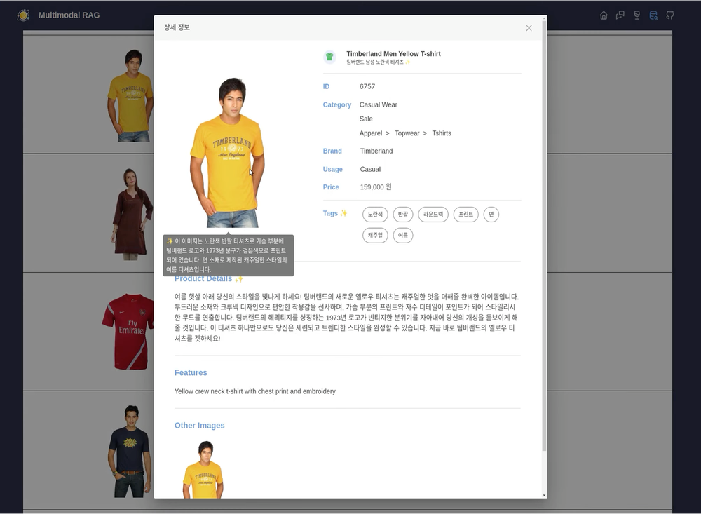
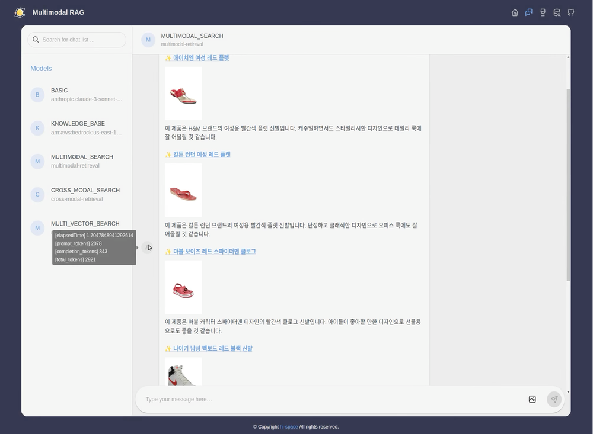
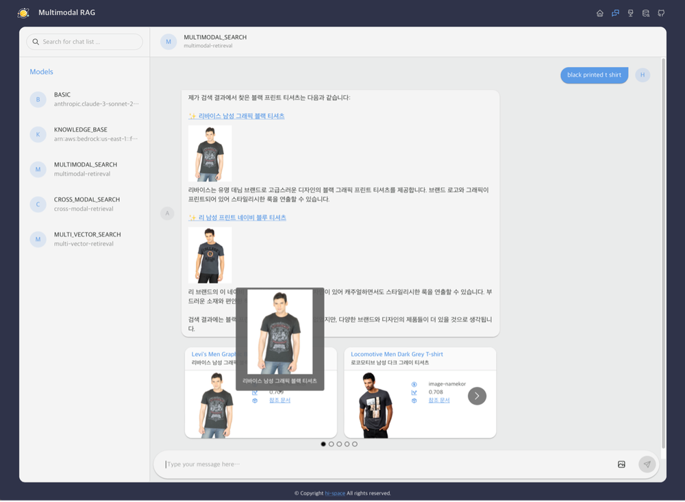

# Multimodal RAG Chatbot

This project implements a fashion product search chatbot using Multimodal RAG (Retrieval-Augmented Generation), Amazon Bedrock, and OpenSearch. The chatbot processes user input to provide optimal product recommendations through both text and image-based searches.

This project is a code implementation of the concepts presented in the blog post, [Multimodal RAG-Based Product Search Chatbot Using Amazon Bedrock and OpenSearch](https://aws.amazon.com/ko/blogs/tech/bedrock-multimodal-rag-chatbot/) If you're interested in understanding the underlying principles and seeing a detailed explanation, I highly recommend checking out the original post.

## Demo Video

[](https://youtu.be/NXuoS0WNyiI)

## Preview

|                                                             |                          |
|---------------------------------------------------------------------------------------------------------|----------------------------------------------------------------------|
| In the item detail dialog, hovering over the image or title will show the caption generated by the LLM. | Use the tabs on the left to select the multimodal RAG search method. |

|                                                                                                                    |                                                                                                         |
|----------------------------------------------------------------------------------------------------------------------------------------------------------------|-----------------------------------------------------------------------------------------------------------------------------------------------------|
| After the chatbot's response is generated, you can hover over the chatbot avatar to see the time taken and the number of tokens used to generate the response. | Below the chatbot conversation, you can view the items referenced during the response generation. Hover to see which embedding data was referenced. |

## Features

- **Item Retrieval from DynamoDB**: The system retrieves product information from a DynamoDB database and provides it through a RESTful API for easy access and integration.

- **Chat History Storage Using Redis**: User chat histories are stored in Redis, a fast, in-memory data store, allowing for quick retrieval and session management.

- **Asynchronous Chat Content Generation and SSE Transmission**: The chatbot generates responses asynchronously, ensuring smooth user interaction, and delivers updates in real-time using Server-Sent Events (SSE).

- **Support for Knowledge Bases in Amazon Bedrock**: The chatbot integrates with Amazon Bedrock to access and utilize various knowledge bases, enhancing its ability to answer complex queries and provide relevant product recommendations.

- **OpenSearch Hybrid Search**: Combines both traditional keyword-based search and semantic search using OpenSearch, enabling more accurate and relevant product search results.

- **Multimodal Embedding and Multimodal LLM**: The system employs multimodal embeddings and a Multimodal Large Language Model (LLM) to process and understand both text and image inputs, allowing for sophisticated, cross-modal product searches.

## Project Structure

```text
├── backend     # Backend project (Python, FastAPI)
├── frontend    # Frontend project (TypeScript, Next.js)
├── data        # Sample data
└── notebooks   # Data preparation notebooks
```

## Getting Started

Before proceeding with the steps below, ensure you have your AWS account information and have set up the necessary infrastructure for Amazon Bedrock, Amazon DynamoDB, and Amazon OpenSearch Service.

1. **Data Preparation**: Refer to the [README](./notebook/README.md) in the notebooks directory and follow the steps to run the code, which will store the embedding data in OpenSearch.
2. **Run the Backend**: Follow the instructions in the backend [README](./backend/README.md) to start the backend server.
3. **Run the Frontend**: Follow the instructions in the frontend [README](./frontend/README.md) to start the frontend application.
