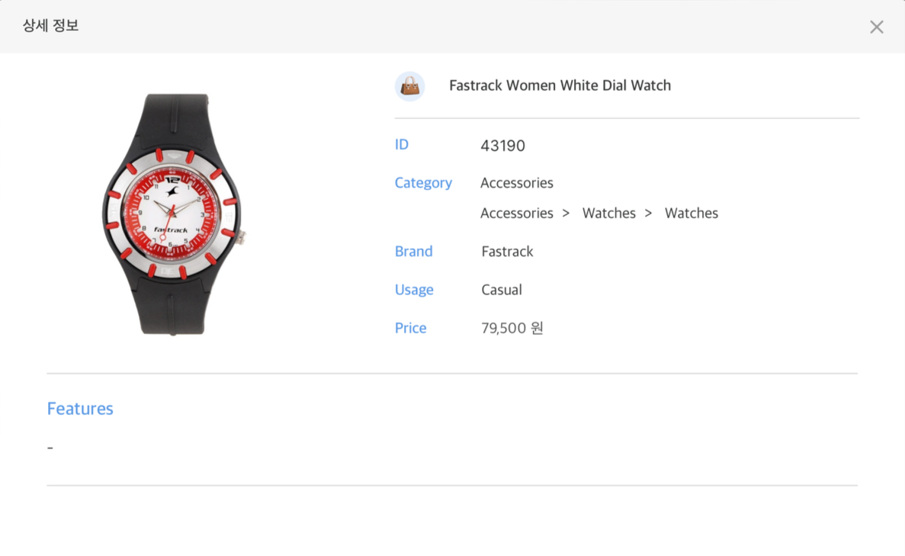
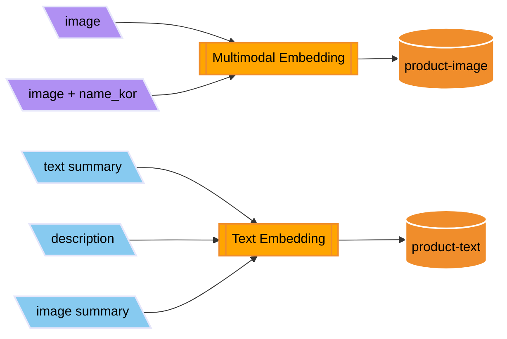
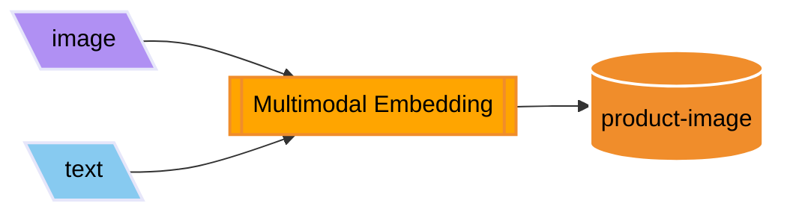

# Multimodal RAG

## Requirements

1. [데이터셋](https://www.kaggle.com/datasets/paramaggarwal/fashion-product-images-dataset) 준비
   - 데이터 augmentation 없이, 생성되어 있는 [샘플 데이터](../data/product.csv)로 테스트 할 경우 skip 가능
2. Bedrock에서 사용할 Model access
3. OpenSearch Service 도메인 생성
4. DynamoDB 테이블 생성
5. `.env` 파일에 값 설정

## Notebooks

1. [데이터 Augmentation](./1-augment-dataset.ipynb)
   - JSON 파일로부터 상품을 관리하기 위한 추가적인 메타데이터(한글 상품명, 상품 요약, 이미지 설명글, 태그)와 상품 소개글을 생성합니다.
   - 생성된 데이터는 csv로 저장하고, csv 파일을 로드해서 DynamoDB에 저장합니다.

| Before Augmentation                 | After Augmentation                |
|-------------------------------------|-----------------------------------|
|  |  |

2. [VectorDB에 Embedding한 값 저장](./2-embedding.ipynb)

3. [Vector Search 테스트](./3-vector-search.ipynb)

- Multimodal Embedding, Text Embedding 별로 쿼리에 따른 검색 결과를 확인합니다.
- Query를 항상 Multimodal Embedding

- Query를 항상 Text Embedding

- Query가 텍스트인 경우 Text Embedding, 이미지를 포함한 경우 Multimodal Embedding

