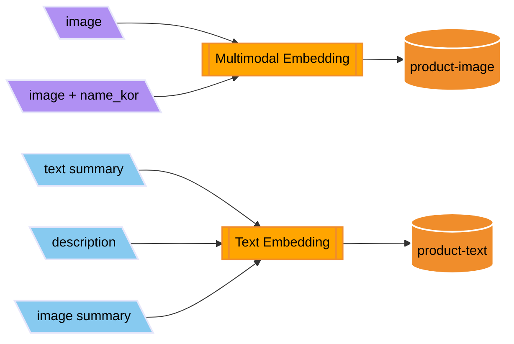
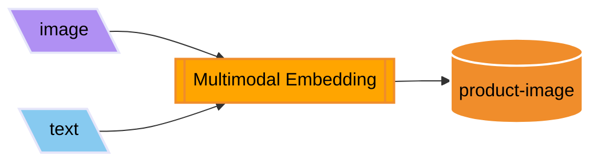
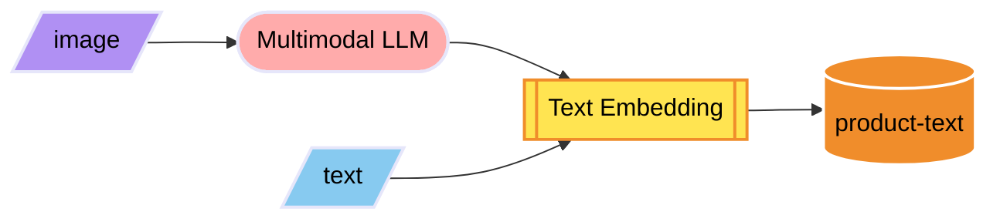
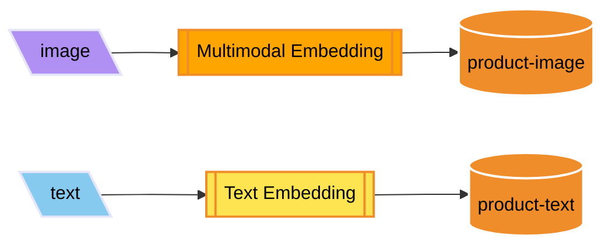

# Preprocessing for Multimodal RAG

- [Preprocessing for Multimodal RAG](#preprocessing-for-multimodal-rag)
  - [Requirements](#requirements)
  - [Notebooks](#notebooks)
      - [1. Data Augmentation](#1-data-augmentation)
      - [2. Storing embedded values in VectorDB](#2-storing-embedded-values-in-vectordb)
      - [3. Vector Search](#3-vector-search)
      - [4. Multimodal RAG Chatbot](#4-multimodal-rag-chatbot)

## Requirements

1. Prepare [dataset](https://www.kaggle.com/datasets/paramaggarwal/fashion-product-images-dataset)
   - If testing with the pre-generated [sample data](../data/product.csv) without data augmentation, this step can be skipped
2. Access the model to be used in Bedrock
3. Create OpenSearch Service domain
4. Create DynamoDB table
5. Set values in the `.env` file

## Notebooks

#### 1. [Data Augmentation](./1-augment-dataset.ipynb)

- Generate additional metadata (Korean product name, product summary, image description, tags) and product introductions from JSON files to manage products.
- Save the generated data as a CSV file, then load the CSV file and store it in DynamoDB.

| Before Augmentation                 | After Augmentation                |
|-------------------------------------|-----------------------------------|
|  |  |

#### 2. [Storing embedded values in VectorDB](./2-embedding.ipynb)

#### 3. [Vector Search](./3-vector-search.ipynb)

Check search results for queries using both Multimodal Embedding and Text Embedding.

- Always use Multimodal Embedding for queries.

- Always use Text Embedding for queries.

- Use Text Embedding when the query is text-only, and Multimodal Embedding when the query includes images.

#### 4. [Multimodal RAG Chatbot](./4-chatbot.ipynb)

Perform continuous conversations with the Multimodal LLM by adding conversation history, retrieval and prompts.
